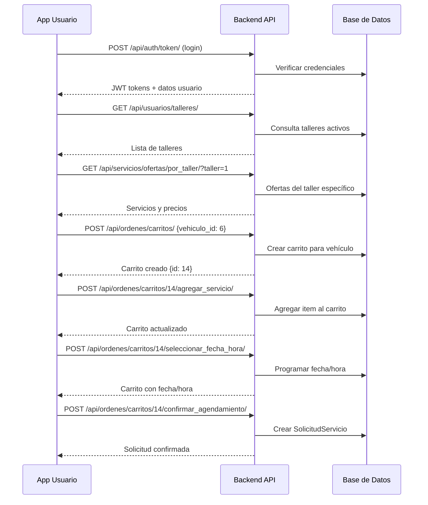
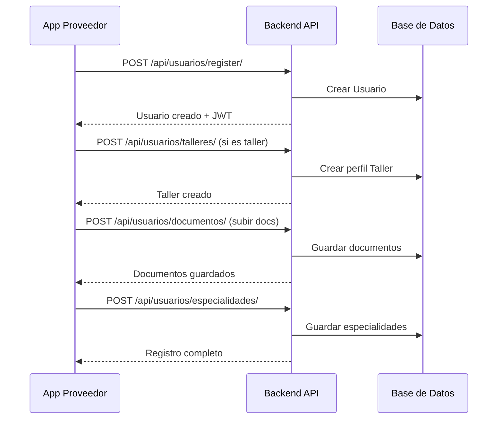

# 🔧 MecaniMóvil Backend - Sistema de Gestión de Servicios Mecánicos

## 📋 Descripción del Proyecto

MecaniMóvil Backend es una API RESTful robusta construida con Django y Django REST Framework que gestiona toda la lógica de negocio para una plataforma de servicios mecánicos. El sistema conecta clientes con talleres mecánicos y mecánicos a domicilio, proporcionando una solución integral para la gestión, agendamiento y seguimiento de servicios automotrices.

### 🔗 Conexiones con Aplicaciones Frontend

Este backend sirve como el núcleo central que conecta dos aplicaciones móviles:

1. **MecaniMóvil App Usuarios** (`mecanimovil-frontend/mecanimovil-app/`)
   - Aplicación para clientes finales
   - Búsqueda y agendamiento de servicios
   - Gestión de vehículos y historial
   - **Conexión**: APIs REST para autenticación, servicios, carritos y órdenes

2. **MecaniMóvil App Proveedores** (`mecanimovil-proveedores/mecanimovil-app-proveedores/`)
   - Aplicación para talleres y mecánicos
   - Registro y gestión de perfiles
   - Configuración de servicios y precios
   - **Conexión**: APIs REST para registro, onboarding y gestión de proveedores

### 🎯 Funcionalidades Principales

#### **Para Clientes (App Usuarios)**:
- Registro y autenticación de usuarios
- Gestión de vehículos personales
- Búsqueda y selección de proveedores de servicios
- Sistema de carritos de compra para servicios
- Agendamiento con fecha y hora específica
- Seguimiento de órdenes en tiempo real
- Historial de servicios y calificaciones

#### **Para Proveedores (App Proveedores)**:
- Registro como taller mecánico o mecánico a domicilio
- Proceso de onboarding y verificación
- Gestión de catálogo de servicios y precios
- Configuración de horarios y disponibilidad
- Recepción y procesamiento de solicitudes

#### **Para Administradores**:
- Panel de administración completo Django
- Gestión de usuarios, servicios y órdenes
- Configuración de precios e IVA
- Análisis y reportes del sistema

---

## 📁 Estructura del Proyecto

```
mecanimovil-backend/
├── manage.py                        # Comando principal de Django
├── requirements.txt                 # Dependencias del proyecto
├── db.sqlite3                      # Base de datos SQLite (desarrollo)
├── mecanimovil_backup.sql          # Backup de datos
├── scripts/                        # Scripts de utilidad
│   ├── crear_vehiculo_martha.py    # Script para crear datos de prueba
│   └── verificar_especialidades.py # Verificación de especialidades
├── media/                          # Archivos subidos por usuarios
│   ├── perfiles/                   # Fotos de perfil
│   ├── vehiculos/                  # Fotos de vehículos
│   ├── documentos/                 # Documentos de verificación
│   └── talleres/                   # Fotos de talleres
├── docs/                           # Documentación del proyecto
├── venv/                           # Entorno virtual de Python
└── mecanimovilapp/                 # Proyecto Django principal
    ├── __init__.py
    ├── settings.py                 # Configuración del proyecto
    ├── urls.py                     # URLs principales
    ├── wsgi.py                     # Configuración WSGI
    ├── asgi.py                     # Configuración ASGI
    ├── middleware/                 # Middleware personalizado
    │   └── vehiculo_activo.py      # Middleware para vehículo activo
    └── apps/                       # Aplicaciones Django
        ├── __init__.py
        ├── usuarios/               # 👥 Gestión de Usuarios
        │   ├── __init__.py
        │   ├── models.py          # Usuario, Cliente, Taller, Mecánico
        │   ├── views.py           # ViewSets para CRUD y acciones
        │   ├── serializers.py     # Serialización de datos
        │   ├── urls.py            # Rutas de la API
        │   ├── admin.py           # Configuración del admin
        │   ├── migrations/        # Migraciones de BD
        │   └── management/        # Comandos personalizados
        │       └── commands/
        │           └── load_initial_data.py
        ├── vehiculos/              # 🚗 Gestión de Vehículos
        │   ├── models.py          # MarcaVehiculo, Modelo, Vehiculo
        │   ├── views.py           # APIs para vehículos
        │   ├── serializers.py     # Serialización
        │   ├── urls.py            # Rutas
        │   └── admin.py           # Admin de vehículos
        ├── servicios/              # 🔧 Catálogo de Servicios
        │   ├── models.py          # CategoriaServicio, Servicio, OfertaServicio
        │   ├── views.py           # APIs de servicios y ofertas
        │   ├── serializers.py     # Serialización de servicios
        │   ├── urls.py            # Rutas de servicios
        │   └── admin.py           # Admin de servicios
        ├── ordenes/                # 📋 Sistema de Órdenes
        │   ├── models.py          # CarritoCompra, SolicitudServicio, LineaServicio
        │   ├── views.py           # APIs de carritos y agendamiento
        │   ├── serializers.py     # Serialización de órdenes
        │   ├── urls.py            # Rutas de órdenes
        │   └── admin.py           # Admin de órdenes
        ├── personalizacion/        # 🎯 Personalización y ML
        │   ├── models.py          # VehiculoActivo, RecomendacionPersonalizada
        │   ├── views.py           # APIs de personalización
        │   ├── serializers.py     # Serialización
        │   ├── urls.py            # Rutas
        │   └── admin.py           # Admin
        └── mecanicos/              # 🔨 Gestión de Mecánicos
            ├── models.py          # Modelos específicos de mecánicos
            ├── views.py           # APIs para mecánicos
            ├── serializers.py     # Serialización
            ├── urls.py            # Rutas
            └── admin.py           # Admin
```

---

## 🏗️ Arquitectura Técnica

### **Stack Tecnológico**

| Tecnología | Versión | Propósito |
|------------|---------|-----------|
| **Django** | 4.2.7 | Framework web principal |
| **Django REST Framework** | 3.14.0 | API RESTful y serialización |
| **PostgreSQL + PostGIS** | Latest | Base de datos con capacidades geoespaciales |
| **psycopg2-binary** | 2.9.10 | Adaptador PostgreSQL para Python |
| **django-cors-headers** | 4.3.1 | Manejo de CORS para frontend |
| **djangorestframework-gis** | 1.0 | Extensiones GIS para DRF |
| **djangorestframework-simplejwt** | 5.3.0 | Autenticación JWT |
| **Pillow** | 10.1.0 | Procesamiento de imágenes |
| **python-decouple** | 3.8 | Gestión de variables de entorno |
| **django-extensions** | 3.2.3 | Utilidades adicionales para Django |
| **PyJWT** | 2.8.0 | Procesamiento de tokens JWT |
| **cryptography** | 41.0.7 | Operaciones criptográficas |
| **django-filter** | 23.4 | Filtrado avanzado de APIs |
| **whitenoise** | 6.6.0 | Servicio de archivos estáticos |
| **gunicorn** | 21.2.0 | Servidor WSGI para producción |
| **daphne** | 4.0.0 | Servidor ASGI para desarrollo y producción |
| **channels** | 4.0.0 | Django Channels para WebSockets |
| **channels-redis** | 4.0.0 | Backend Redis para Channels |
| **celery** | 5.3.4 | Procesamiento asíncrono de tareas |
| **redis** | 5.0.1 | Cache y broker para Celery |
| **numpy** | 1.24.3 | Computación numérica |
| **pandas** | 2.0.3 | Análisis de datos |
| **scikit-learn** | 1.3.0 | Machine Learning para recomendaciones |

### **Configuración de Base de Datos**

```python
# Configuración PostgreSQL con PostGIS para producción
DATABASES = {
    'default': {
        'ENGINE': 'django.contrib.gis.db.backends.postgis',
        'NAME': 'mecanimovil',
        'USER': 'sebastianm',
        'PASSWORD': '',
        'HOST': 'localhost',
        'PORT': '5432',
    }
}

# SQLite para desarrollo local
DATABASES = {
    'default': {
        'ENGINE': 'django.db.backends.sqlite3',
        'NAME': BASE_DIR / 'db.sqlite3',
    }
}
```

---

## 🌐 API RESTful - Conexiones con Frontends

### **🔗 Conexión con App Usuarios (React Native)**

#### **Autenticación y Perfil**
| Endpoint | Método | Descripción | Usado en Frontend |
|----------|---------|-------------|-------------------|
| `/api/auth/token/` | POST | Login y obtención de JWT | `AuthContext.login()` |
| `/api/auth/token/refresh/` | POST | Renovación de token | Interceptor automático |
| `/api/usuarios/register/` | POST | Registro de nuevos usuarios | `RegisterScreen` |
| `/api/usuarios/perfil/` | GET, PUT | Gestión de perfil | `UserProfileScreen` |

#### **Vehículos del Usuario**
| Endpoint | Método | Frontend Component |
|----------|---------|-------------------|
| `/api/vehiculos/vehiculos/` | GET, POST | `MisVehiculosScreen` |
| `/api/vehiculos/marcas/` | GET | `VehicleRegistrationForm` |
| `/api/vehiculos/modelos/` | GET | `ModelSelector` |

#### **Búsqueda y Servicios**
| Endpoint | Frontend Usage |
|----------|----------------|
| `/api/usuarios/talleres/` | `TalleresScreen`, `UserPanelScreen` |
| `/api/usuarios/mecanicos/` | `MecanicosScreen` |
| `/api/servicios/categorias/` | `CategoriesHierarchy` |
| `/api/servicios/ofertas/por_taller/` | `ProviderDetailScreen` |

#### **Sistema de Carritos y Agendamiento**
| Endpoint | Frontend Integration |
|----------|---------------------|
| `/api/ordenes/carritos/` | `AgendamientoContext` |
| `/api/ordenes/carritos/activo/` | `CarritoAgendamiento` |
| `/api/ordenes/carritos/{id}/agregar_servicio/` | `ConfiguradorServicio` |
| `/api/ordenes/carritos/{id}/confirmar_agendamiento/` | `OpcionesPago` |

### **🔗 Conexión con App Proveedores (React Native + TypeScript)**

#### **Registro de Proveedores**
| Endpoint | Frontend Screen |
|----------|----------------|
| `/api/usuarios/register/` | `(auth)/registro.tsx` |
| `/api/usuarios/talleres/` | `(onboarding)/informacion-basica.tsx` |
| `/api/usuarios/mecanicos-domicilio/` | `(onboarding)/informacion-basica.tsx` |

#### **Onboarding y Documentación**
| Endpoint | Frontend Usage |
|----------|----------------|
| `/api/usuarios/documentos/` | `(onboarding)/documentacion.tsx` |
| `/api/vehiculos/marcas/` | `(onboarding)/especialidades.tsx` |
| `/api/usuarios/especialidades/` | `(onboarding)/especialidades.tsx` |

---

## 📊 Modelo de Datos - Estructura Detallada

### **App: usuarios/ - Gestión de Usuarios**

```python
# models.py - Modelos principales
class Usuario(AbstractUser):
    """Usuario base del sistema (hereda de AbstractUser)"""
    es_mecanico = models.BooleanField(default=False)
    telefono = models.CharField(max_length=20, blank=True, null=True)
    direccion = models.CharField(max_length=255, blank=True, null=True)
    foto_perfil = models.ImageField(upload_to='perfiles/', blank=True, null=True)

class Cliente(models.Model):
    """Cliente que solicita servicios"""
    usuario = models.OneToOneField(Usuario, on_delete=models.CASCADE)
    ubicacion = gis_models.PointField(geography=True, blank=True, null=True)
    fecha_registro = models.DateTimeField(auto_now_add=True)

class ProveedorServicio(models.Model):
    """Clase abstracta para Talleres y Mecánicos"""
    nombre = models.CharField(max_length=255)
    descripcion = models.TextField(blank=True)
    ubicacion = gis_models.PointField(geography=True, null=True)
    calificacion_promedio = models.FloatField(default=0.0)
    activo = models.BooleanField(default=True)
    
    class Meta:
        abstract = True

class Taller(ProveedorServicio):
    """Taller mecánico físico"""
    propietario = models.OneToOneField(Usuario, on_delete=models.CASCADE)
    direccion = models.CharField(max_length=255)
    capacidad_diaria = models.PositiveIntegerField(default=10)
    horario_inicio = models.TimeField(default='08:00')
    horario_fin = models.TimeField(default='18:00')

class MecanicoDomicilio(ProveedorServicio):
    """Mecánico que ofrece servicios a domicilio"""
    mecanico = models.OneToOneField(Usuario, on_delete=models.CASCADE)
    años_experiencia = models.PositiveIntegerField()
    zona_cobertura = gis_models.PolygonField(geography=True, null=True)
```

### **App: vehiculos/ - Gestión de Vehículos**

```python
class MarcaVehiculo(models.Model):
    """Marcas de vehículos (Toyota, Ford, etc.)"""
    nombre = models.CharField(max_length=100, unique=True)
    logo = models.ImageField(upload_to='marcas/', blank=True, null=True)

class Modelo(models.Model):
    """Modelos específicos de cada marca"""
    marca = models.ForeignKey(MarcaVehiculo, on_delete=models.CASCADE)
    nombre = models.CharField(max_length=100)
    año_inicio = models.PositiveIntegerField()
    año_fin = models.PositiveIntegerField(null=True, blank=True)

class Vehiculo(models.Model):
    """Vehículo de un cliente específico"""
    cliente = models.ForeignKey(Cliente, on_delete=models.CASCADE)
    modelo = models.ForeignKey(Modelo, on_delete=models.CASCADE)
    año = models.PositiveIntegerField()
    patente = models.CharField(max_length=20, unique=True)
    color = models.CharField(max_length=50)
    kilometraje = models.PositiveIntegerField(default=0)
```

### **App: servicios/ - Catálogo de Servicios**

```python
class CategoriaServicio(models.Model):
    """Categorías jerárquicas de servicios"""
    categoria_padre = models.ForeignKey('self', null=True, blank=True)
    nombre = models.CharField(max_length=100, unique=True)
    icono = models.CharField(max_length=50, blank=True)

class Servicio(models.Model):
    """Servicios mecánicos disponibles"""
    nombre = models.CharField(max_length=255)
    descripcion = models.TextField()
    categorias = models.ManyToManyField(CategoriaServicio)
    modelos_compatibles = models.ManyToManyField(Modelo)
    servicios_relacionados = models.ManyToManyField('self', blank=True)

class OfertaServicio(models.Model):
    """Oferta específica de un proveedor para un servicio"""
    servicio = models.ForeignKey(Servicio, on_delete=models.CASCADE)
    taller = models.ForeignKey(Taller, null=True, blank=True)
    mecanico = models.ForeignKey(MecanicoDomicilio, null=True, blank=True)
    precio_con_repuestos = models.DecimalField(max_digits=10, decimal_places=2)
    precio_sin_repuestos = models.DecimalField(max_digits=10, decimal_places=2)
    disponible = models.BooleanField(default=True)
```

### **App: ordenes/ - Sistema de Órdenes**

```python
class CarritoCompra(models.Model):
    """Carrito de compras persistente por vehículo"""
    cliente = models.ForeignKey(Cliente, on_delete=models.CASCADE)
    vehiculo = models.ForeignKey(Vehiculo, on_delete=models.CASCADE)
    fecha_servicio = models.DateField(null=True, blank=True)
    hora_servicio = models.TimeField(null=True, blank=True)
    activo = models.BooleanField(default=True)
    fecha_creacion = models.DateTimeField(auto_now_add=True)

class ItemCarrito(models.Model):
    """Items individuales dentro del carrito"""
    carrito = models.ForeignKey(CarritoCompra, on_delete=models.CASCADE, related_name='items')
    oferta_servicio = models.ForeignKey(OfertaServicio, on_delete=models.CASCADE)
    con_repuestos = models.BooleanField(default=True)
    cantidad = models.PositiveIntegerField(default=1)

class SolicitudServicio(models.Model):
    """Solicitud final confirmada por el cliente"""
    carrito = models.ForeignKey(CarritoCompra, on_delete=models.CASCADE)
    estado = models.CharField(max_length=30, choices=ESTADO_CHOICES)
    metodo_pago = models.CharField(max_length=20, choices=METODO_PAGO_CHOICES)
    total = models.DecimalField(max_digits=10, decimal_places=2)
    fecha_hora_solicitud = models.DateTimeField(auto_now_add=True)
    notas_cliente = models.TextField(blank=True)
    acepta_terminos = models.BooleanField(default=False)
```

---

## 🔄 Flujos de Integración Frontend-Backend

### **🔄 Flujo Completo: Usuario Agenda un Servicio**



### **🔄 Flujo: Proveedor se Registra**



---

## ⚙️ Configuración y Despliegue

### 📚 Documentación Detallada

- **[📖 Guía de Desarrollo Local](README_DESARROLLO.md)** - Configuración completa para desarrollo local con Daphne
- **[🚀 Script de Producción](deploy_production.sh)** - Deployment automático para producción
- **[🌐 Configuración ngrok](README_NGROK.md)** - Configuración de ngrok para webhooks

### **Inicio Rápido (Desarrollo Local)**

Para una configuración rápida en desarrollo local:

```bash
# 1. Clonar repositorio
git clone [url-del-repositorio]
cd mecanimovil-backend

# 2. Configuración automática (recomendado)
chmod +x setup_dev.sh
./setup_dev.sh

# 3. Iniciar servidor de desarrollo con Daphne
./start_dev.sh
```

El script `setup_dev.sh` realiza automáticamente:
- ✅ Creación del entorno virtual
- ✅ Instalación de dependencias
- ✅ Creación del archivo `.env` de ejemplo
- ✅ Aplicación de migraciones
- ✅ Opción para crear superusuario

### **Iniciar Servidor de Desarrollo**

⚠️ **IMPORTANTE:** Este proyecto usa **Daphne** (servidor ASGI) para soportar WebSockets. No uses `runserver` para desarrollo completo.

#### Método Recomendado: Script Automático

```bash
./start_dev.sh
# O con puerto específico:
./start_dev.sh 8080
```

#### Método Manual

```bash
# Activar entorno virtual
source venv/bin/activate

# Iniciar con Daphne (recomendado para desarrollo)
daphne -b 0.0.0.0 -p 8000 mecanimovilapp.asgi:application
```

### **Variables de Entorno (.env)**

Crea un archivo `.env` en la raíz del proyecto:

```env
# Django Settings
DEBUG=True
SECRET_KEY=your-secret-key-here
ALLOWED_HOSTS=localhost,127.0.0.1,0.0.0.0

# Base de datos (PostgreSQL)
DB_NAME=mecanimovil
DB_USER=tu_usuario_postgres
DB_PASSWORD=tu_contraseña
DB_HOST=localhost
DB_PORT=5432

# CORS para frontends
CORS_ALLOWED_ORIGINS=http://localhost:8081,http://192.168.1.100:8081

# Redis (para WebSockets y Celery)
REDIS_URL=redis://localhost:6379/0

# JWT Configuration
JWT_ACCESS_TOKEN_LIFETIME=60
JWT_REFRESH_TOKEN_LIFETIME=10080

# Archivos media
MEDIA_URL=/media/
STATIC_URL=/static/

# Mercado Pago (credenciales de prueba para desarrollo)
MERCADOPAGO_ACCESS_TOKEN=TU_ACCESS_TOKEN_AQUI
MERCADOPAGO_PUBLIC_KEY=TU_PUBLIC_KEY_AQUI
MERCADOPAGO_WEBHOOK_SECRET=a7934fae72aca801d2bd08aeaa79b0d650c7900c0def8aa559583934d9de44ee

# Email settings (opcional para desarrollo)
EMAIL_BACKEND=django.core.mail.backends.console.EmailBackend
```

⚠️ **Nota:** El archivo `.env` está en `.gitignore` y no debe subirse a Git. Usa `.env.example` como plantilla si lo necesitas.

### **URLs del Sistema**

```
# API Base
http://localhost:8000/api/

# Endpoints principales para App Usuario
http://localhost:8000/api/auth/token/          # Login
http://localhost:8000/api/usuarios/talleres/   # Talleres
http://localhost:8000/api/ordenes/carritos/    # Carritos

# Endpoints para App Proveedores
http://localhost:8000/api/usuarios/register/   # Registro
http://localhost:8000/api/usuarios/talleres/   # Perfil taller
http://localhost:8000/api/usuarios/mecanicos-domicilio/  # Perfil mecánico

# Admin Panel
http://localhost:8000/admin/

# Archivos media
http://localhost:8000/media/
```

---

## 🛡️ Seguridad y Autenticación

### **Sistema JWT**

```python
# settings.py - Configuración JWT
from datetime import timedelta

SIMPLE_JWT = {
    'ACCESS_TOKEN_LIFETIME': timedelta(minutes=60),
    'REFRESH_TOKEN_LIFETIME': timedelta(days=7),
    'ROTATE_REFRESH_TOKENS': True,
    'BLACKLIST_AFTER_ROTATION': True,
    'UPDATE_LAST_LOGIN': True,
}

# Middleware de autenticación
REST_FRAMEWORK = {
    'DEFAULT_AUTHENTICATION_CLASSES': [
        'rest_framework_simplejwt.authentication.JWTAuthentication',
    ],
    'DEFAULT_PERMISSION_CLASSES': [
        'rest_framework.permissions.IsAuthenticated',
    ],
}
```

### **Permisos Personalizados**

```python
# Ejemplos de permisos en views.py
class CarritoViewSet(viewsets.ModelViewSet):
    permission_classes = [IsAuthenticated, IsOwnerOrReadOnly]
    
    def get_queryset(self):
        # Solo carritos del usuario autenticado
        return CarritoCompra.objects.filter(
            cliente__usuario=self.request.user
        )

class TallerViewSet(viewsets.ModelViewSet):
    permission_classes = [IsProveedorOrReadOnly]
    
    def perform_create(self, serializer):
        # Asociar taller al usuario autenticado
        serializer.save(propietario=self.request.user)
```

---

## 📈 Monitoreo y Logging

### **Sistema de Logs**

```python
# settings.py - Configuración de logging
LOGGING = {
    'version': 1,
    'disable_existing_loggers': False,
    'handlers': {
        'file': {
            'level': 'INFO',
            'class': 'logging.FileHandler',
            'filename': 'mecanimovil.log',
        },
        'console': {
            'level': 'DEBUG',
            'class': 'logging.StreamHandler',
        },
    },
    'loggers': {
        'mecanimovilapp': {
            'handlers': ['file', 'console'],
            'level': 'INFO',
            'propagate': True,
        },
    },
}
```

### **Métricas del Sistema**

```python
# Comando para generar reportes
python manage.py shell

# Estadísticas básicas
from mecanimovilapp.apps.usuarios.models import *
from mecanimovilapp.apps.ordenes.models import *

print(f"Usuarios registrados: {Usuario.objects.count()}")
print(f"Talleres activos: {Taller.objects.filter(activo=True).count()}")
print(f"Servicios agendados: {SolicitudServicio.objects.count()}")
print(f"Carritos activos: {CarritoCompra.objects.filter(activo=True).count()}")
```

---

## 🚀 Comandos de Mantenimiento

```bash
# Backup de la base de datos
python manage.py dumpdata > backup_$(date +%Y%m%d).json

# Restaurar datos
python manage.py loaddata backup_20250105.json

# Limpiar sesiones expiradas
python manage.py clearsessions

# Recolectar archivos estáticos
python manage.py collectstatic --noinput

# Ejecutar tests
python manage.py test

# Crear migraciones
python manage.py makemigrations

# Ver estado de migraciones
python manage.py showmigrations

# Shell interactivo
python manage.py shell

# Crear superusuario
python manage.py createsuperuser

# Cargar datos iniciales
python manage.py load_initial_data
```

---

## 🔧 Desarrollo y Testing

### **Estructura de Tests**

```bash
# Ejecutar todos los tests
python manage.py test

# Test específico de app
python manage.py test mecanimovilapp.apps.usuarios

# Test con cobertura
coverage run manage.py test
coverage report
coverage html
```

### **Datos de Prueba**

El proyecto incluye scripts para generar datos de prueba:

```bash
# Crear vehículo de prueba
python crear_vehiculo_martha.py

# Verificar especialidades
python verificar_especialidades.py

# Cargar datos iniciales
python manage.py load_initial_data
```

---

## 📞 Soporte y Documentación

### **Recursos Adicionales**

- **API Documentation**: Disponible en `/api/docs/` (si está configurado swagger)
- **Admin Panel**: `/admin/` para gestión administrativa
- **Logs**: Revisa `mecanimovil.log` para debugging
- **Base de Datos**: Estructura documentada en modelos de cada app

### **Contacto de Desarrollo**

- **Repositorio**: [GitHub Link]
- **Documentación**: Ver `/docs/` folder
- **Issues**: Reportar en GitHub Issues
- **Email**: desarrollo@mecanimovil.com

Este backend proporciona una API REST robusta y escalable que sirve como núcleo central para conectar las aplicaciones móviles de usuarios y proveedores, manteniendo la integridad de datos y proporcionando todas las funcionalidades necesarias para la plataforma MecaniMóvil. 