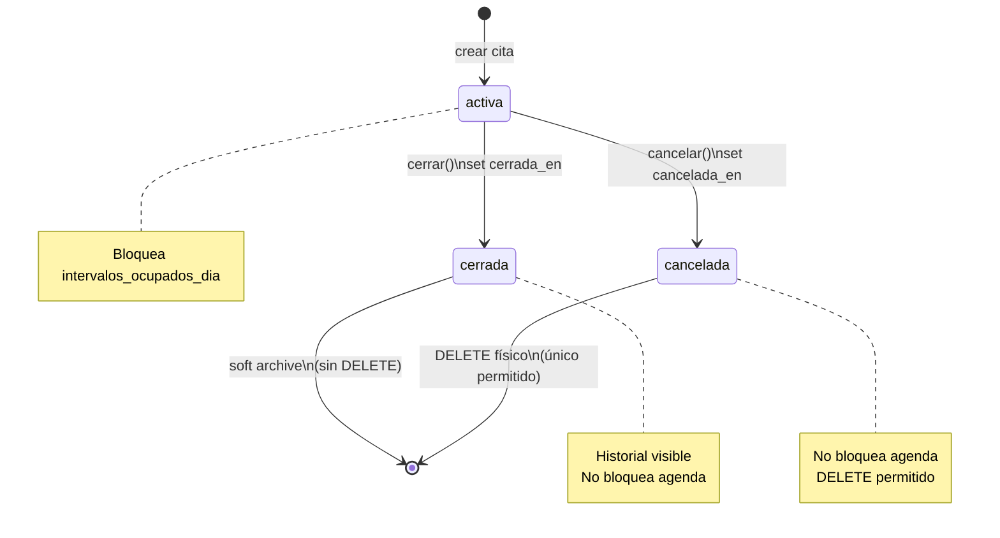

# Diseño de base de datos — Agenda citas personales

**Change:** `agenda-citas-personales`  
**App Django:** `mecanimovilapp.apps.ordenes`  
**Autor:** Agent 1 — Database Design Specialist  
**Fecha:** 2026-06-19

## Resumen

Las citas personales permiten al proveedor registrar compromisos fuera de Mecanimovil
(cliente walk-in, referido, WhatsApp) y bloquear su agenda real. El diseño separa
**scheduling** (`CitaAgendaPersonal`) de **datos del cliente/servicio** (`CitaAgendaPersonalDetalle`)
en relación 1:1 para normalización y consultas eficientes de disponibilidad.

---

## 1. Diagrama entidad-relación

```mermaid
erDiagram
    Taller ||--o{ CitaAgendaPersonal : "atiende"
    MecanicoDomicilio ||--o{ CitaAgendaPersonal : "atiende"
    Usuario ||--o{ CitaAgendaPersonal : "creado_por"
    CitaAgendaPersonal ||--|| CitaAgendaPersonalDetalle : "detalle"
    OfertaServicio ||--o{ CitaAgendaPersonalDetalle : "opcional"

    Taller {
        bigint id PK
        varchar nombre
    }

    MecanicoDomicilio {
        bigint id PK
        varchar nombre
    }

    Usuario {
        bigint id PK
        varchar username
    }

    CitaAgendaPersonal {
        bigint id PK
        bigint taller_id FK "nullable XOR"
        bigint mecanico_id FK "nullable XOR"
        date fecha_servicio
        time hora_servicio
        int duracion_minutos
        varchar tipo_servicio "taller|domicilio"
        varchar estado "activa|cerrada|cancelada"
        timestamptz cerrada_en "nullable"
        timestamptz cancelada_en "nullable"
        bigint creado_por_id FK
        timestamptz fecha_creacion
        timestamptz fecha_actualizacion
    }

    CitaAgendaPersonalDetalle {
        bigint cita_id PK_FK
        varchar cliente_nombre
        varchar cliente_telefono "nullable"
        varchar direccion "nullable"
        varchar vehiculo_marca "nullable"
        varchar vehiculo_modelo "nullable"
        varchar vehiculo_patente "nullable"
        int vehiculo_anio "nullable"
        varchar vehiculo_color "nullable"
        bigint oferta_servicio_id FK "nullable"
        varchar servicio_nombre "nullable"
        text descripcion "nullable"
        decimal precio_referencia "nullable"
    }

    OfertaServicio {
        bigint id PK
        bigint servicio_id FK
    }
```

---

## 2. Definiciones de tablas

### 2.1 `ordenes_citaagendapersonal`

Cabecera de la cita: proveedor, ventana temporal, estado y auditoría.

| Columna | Tipo PostgreSQL | Django field | Null | Default | Descripción |
|---------|-----------------|--------------|------|---------|-------------|
| `id` | `BIGSERIAL` | `BigAutoField` PK | NO | auto | Identificador |
| `taller_id` | `BIGINT` | `FK → usuarios.Taller` | SÍ | — | Proveedor taller (XOR) |
| `mecanico_id` | `BIGINT` | `FK → usuarios.MecanicoDomicilio` | SÍ | — | Proveedor mecánico (XOR) |
| `fecha_servicio` | `DATE` | `DateField` | NO | — | Día de la cita |
| `hora_servicio` | `TIME` | `TimeField` | NO | — | Hora de inicio |
| `duracion_minutos` | `INTEGER` | `PositiveIntegerField` | NO | `60` | Duración para bloqueo de agenda |
| `tipo_servicio` | `VARCHAR(20)` | `CharField(choices)` | NO | — | `taller` \| `domicilio` |
| `estado` | `VARCHAR(20)` | `CharField(choices)` | NO | `'activa'` | `activa` \| `cerrada` \| `cancelada` |
| `cerrada_en` | `TIMESTAMPTZ` | `DateTimeField` | SÍ | — | Timestamp al cerrar |
| `cancelada_en` | `TIMESTAMPTZ` | `DateTimeField` | SÍ | — | Timestamp al cancelar |
| `creado_por_id` | `BIGINT` | `FK → usuarios.Usuario` | NO | — | Usuario proveedor que creó la cita |
| `fecha_creacion` | `TIMESTAMPTZ` | `DateTimeField(auto_now_add)` | NO | `now()` | Auditoría |
| `fecha_actualizacion` | `TIMESTAMPTZ` | `DateTimeField(auto_now)` | NO | `now()` | Auditoría |

**Foreign keys**

| FK | ON DELETE | Justificación |
|----|-----------|---------------|
| `taller_id` | `CASCADE` | Mismo patrón que `SolicitudServicio.taller` |
| `mecanico_id` | `CASCADE` | Mismo patrón que `SolicitudServicio.mecanico` |
| `creado_por_id` | `PROTECT` | Preservar auditoría si se desactiva usuario |

**Check constraints**

```sql
-- XOR proveedor (patrón HorarioProveedor / SolicitudServicio)
CONSTRAINT cita_xor_proveedor CHECK (
    (taller_id IS NOT NULL AND mecanico_id IS NULL)
    OR (taller_id IS NULL AND mecanico_id IS NOT NULL)
);

-- Duración positiva
CONSTRAINT cita_duracion_positiva CHECK (duracion_minutos > 0);

-- Coherencia estado ↔ timestamps
CONSTRAINT cita_cerrada_requiere_ts CHECK (
    estado <> 'cerrada' OR cerrada_en IS NOT NULL
);
CONSTRAINT cita_cancelada_requiere_ts CHECK (
    estado <> 'cancelada' OR cancelada_en IS NOT NULL
);

-- Timestamps solo en su estado terminal correspondiente
CONSTRAINT cita_cerrada_en_solo_cerrada CHECK (
    cerrada_en IS NULL OR estado = 'cerrada'
);
CONSTRAINT cita_cancelada_en_solo_cancelada CHECK (
    cancelada_en IS NULL OR estado = 'cancelada'
);
```

**Índices**

| Nombre | Columnas | Tipo | Propósito |
|--------|----------|------|-----------|
| `cita_taller_fecha_estado_idx` | `(taller_id, fecha_servicio, estado)` | B-tree | Listado y bloqueo agenda taller |
| `cita_mecanico_fecha_estado_idx` | `(mecanico_id, fecha_servicio, estado)` | B-tree | Listado y bloqueo agenda mecánico |
| `cita_activa_fecha_idx` | `(fecha_servicio)` | Partial `WHERE estado = 'activa'` | Query rápida en `intervalos_ocupados_dia` |
| `cita_estado_idx` | `(estado)` | B-tree | Filtros por estado en API |
| `cita_creado_por_idx` | `(creado_por_id, fecha_creacion DESC)` | B-tree | Historial por proveedor |

---

### 2.2 `ordenes_citaagendapersonaldetalle`

Datos desnormalizados del cliente externo y del servicio. Relación 1:1 estricta con la cabecera.

| Columna | Tipo PostgreSQL | Django field | Null | Default | Descripción |
|---------|-----------------|--------------|------|---------|-------------|
| `cita_id` | `BIGINT` | `OneToOneField(CitaAgendaPersonal, primary_key=True)` | NO | — | PK = FK a cabecera |
| `cliente_nombre` | `VARCHAR(200)` | `CharField` | NO | — | Nombre del cliente externo |
| `cliente_telefono` | `VARCHAR(20)` | `CharField` | SÍ | — | Contacto opcional |
| `direccion` | `VARCHAR(500)` | `CharField` | SÍ | — | Requerido en app si `tipo_servicio = domicilio` |
| `vehiculo_marca` | `VARCHAR(100)` | `CharField` | SÍ | — | Texto libre (sin FK a catálogo) |
| `vehiculo_modelo` | `VARCHAR(100)` | `CharField` | SÍ | — | Texto libre |
| `vehiculo_patente` | `VARCHAR(20)` | `CharField` | SÍ | — | Texto libre |
| `vehiculo_anio` | `INTEGER` | `PositiveIntegerField` | SÍ | — | Año del vehículo |
| `vehiculo_color` | `VARCHAR(30)` | `CharField` | SÍ | — | Color opcional |
| `oferta_servicio_id` | `BIGINT` | `FK → servicios.OfertaServicio` | SÍ | — | Catálogo del proveedor (opcional) |
| `servicio_nombre` | `VARCHAR(255)` | `CharField` | SÍ | — | Nombre manual si no hay oferta |
| `descripcion` | `TEXT` | `TextField` | SÍ | — | Notas libres |
| `precio_referencia` | `NUMERIC(10,2)` | `DecimalField` | SÍ | — | Referencia informativa (sin cobro MP) |

**Foreign keys**

| FK | ON DELETE | Justificación |
|----|-----------|---------------|
| `cita_id` | `CASCADE` | Detalle no existe sin cabecera |
| `oferta_servicio_id` | `SET NULL` | Preservar cita si se retira oferta del catálogo |

**Check constraints**

```sql
-- Al menos una fuente de nombre de servicio
CONSTRAINT cita_detalle_servicio_requerido CHECK (
    oferta_servicio_id IS NOT NULL
    OR (servicio_nombre IS NOT NULL AND btrim(servicio_nombre) <> '')
);

-- Precio no negativo
CONSTRAINT cita_detalle_precio_nonneg CHECK (
    precio_referencia IS NULL OR precio_referencia >= 0
);
```

**Índices**

| Nombre | Columnas | Propósito |
|--------|----------|-----------|
| `cita_detalle_oferta_idx` | `(oferta_servicio_id)` | Joins con catálogo |
| `cita_detalle_cliente_nombre_idx` | `(cliente_nombre)` | Búsqueda por nombre (admin) |

**Validaciones en capa aplicación (no CHECK en BD)**

- Si `tipo_servicio = 'domicilio'`, `direccion` no vacía.
- Si `oferta_servicio_id` presente, la oferta debe pertenecer al mismo `taller`/`mecanico` de la cabecera.
- Coherencia `tipo_servicio` ↔ proveedor: taller → `taller`, mecánico → `domicilio` (warning si mismatch).

---

## 3. Justificación de normalización

### Primera forma normal (1NF)

- Todos los atributos son atómicos: no hay listas JSON ni campos repetidos para vehículo.
- `vehiculo_marca`, `vehiculo_modelo`, etc. son columnas escalares (cliente externo sin registro en `vehiculos.Vehiculo`).
- Clave primaria simple en cabecera (`id`); detalle usa PK = FK (`cita_id`) garantizando unicidad 1:1.

### Segunda forma normal (2NF)

- Cabecera: todos los atributos dependen de la clave completa `id`.
- Detalle: PK es un solo atributo (`cita_id`); no hay dependencias parciales.
- Datos de cliente/vehículo/servicio viven en detalle porque **no determinan** la ventana temporal ni el proveedor — evita redundancia si en el futuro se permitiera editar scheduling sin tocar PII.

### Tercera forma normal (3NF)

- Separación cabecera/detalle elimina dependencias transitivas:
  - `cliente_nombre` no debería determinar `fecha_servicio` ni `duracion_minutos`.
  - `oferta_servicio_id` → nombre de servicio en catálogo es transitivo; por eso `servicio_nombre` manual es alternativa explícita, no derivada automática en la cabecera.
- Estado y timestamps terminales están en cabecera (donde ocurre el ciclo de vida), no duplicados en detalle.

**Trade-off consciente:** campos de vehículo como texto (no FK a `MarcaVehiculo`/`Modelo`) sacrifican integridad referencial a favor de fricción cero para clientes no registrados — requisito de producto.

---

## 4. Máquina de estados



| Transición | Precondición | Efecto en BD |
|------------|--------------|--------------|
| → `activa` | XOR proveedor, fecha/hora válidas | INSERT cabecera + detalle |
| `activa` → `cerrada` | `estado == activa` | `estado='cerrada'`, `cerrada_en=now()` |
| `activa` → `cancelada` | `estado == activa` | `estado='cancelada'`, `cancelada_en=now()` |
| DELETE | `estado == cancelada` | DELETE cabecera (CASCADE detalle) |
| Editar fecha/hora/duración | `estado == activa` | UPDATE cabecera |
| Reactivar | — | **No permitido** |

---

## 5. Integración con `disponibilidad_proveedor.py`

### 5.1 Estado actual

`intervalos_ocupados_dia` consulta solo `SolicitudServicio` con:

```python
ESTADOS_OCUPAN_AGENDA = (
    'pendiente', 'confirmado', 'en_proceso', 'aceptada_por_proveedor',
)
```

Duración derivada de `LineaServicio` / `oferta_proveedor` vía `_duracion_solicitud_minutos`.

### 5.2 Cambio propuesto

```python
ESTADOS_CITA_PERSONAL_OCUPAN = ('activa',)

def _intervalos_citas_personales_dia(
    *,
    taller: Taller | None = None,
    mecanico: MecanicoDomicilio | None = None,
    fecha: date,
    tiempo_descanso: int = 0,
) -> list[tuple[datetime, datetime]]:
    filtros = {'fecha_servicio': fecha, 'estado__in': ESTADOS_CITA_PERSONAL_OCUPAN}
    if taller:
        filtros['taller'] = taller
    else:
        filtros['mecanico'] = mecanico

    intervalos = []
    for cita in CitaAgendaPersonal.objects.filter(**filtros):
        inicio = datetime.combine(fecha, cita.hora_servicio)
        fin = inicio + timedelta(minutes=cita.duracion_minutos + tiempo_descanso)
        intervalos.append((inicio, fin))
    return intervalos
```

**Modificación en `intervalos_ocupados_dia`:**

1. Calcular intervalos de `SolicitudServicio` (sin cambios).
2. Calcular intervalos de `CitaAgendaPersonal` activas (nuevo).
3. Concatenar y pasar por `_merge_intervals` existente.

```python
def intervalos_ocupados_dia(...) -> list[tuple[datetime, datetime]]:
    intervalos_sol = ...  # lógica actual
    intervalos_cita = _intervalos_citas_personales_dia(
        taller=taller, mecanico=mecanico, fecha=fecha,
        tiempo_descanso=tiempo_descanso,
    )
    return _merge_intervals(intervalos_sol + intervalos_cita)
```

### 5.3 Qué NO cambia

| Función | Comportamiento |
|---------|----------------|
| `ventanas_libres` | Sin cambios (recibe intervalos ya fusionados) |
| `slots_en_ventanas` | Sin cambios |
| `disponibilidad_con_duracion` | Beneficia automáticamente del merge |
| `dias_con_slots` | Beneficia automáticamente |
| `estado_actual_proveedor` | **Sin cambio v1** — citas personales no tienen estado `en_proceso`; opcional fase 2 |

### 5.4 Impacto en spec `agendamiento-disponibilidad`

Agregar escenario:

- GIVEN proveedor con cita personal `activa` el mismo día a las 10:00, duración 90 min
- WHEN `disponibilidad_con_duracion` para esa fecha
- THEN ningún slot se solape con `[10:00, 11:30)` (+ `tiempo_descanso` de `HorarioProveedor`)

Citas `cerrada` o `cancelada` **SHALL NOT** reducir slots disponibles.

### 5.5 Query plan esperado

Filtro `(taller_id, fecha_servicio, estado='activa')` cubierto por índice compuesto + partial index.
Prefetch de detalle **no necesario** para disponibilidad (solo cabecera).

---

## 6. Pseudo-código Django

```python
# mecanimovilapp/apps/ordenes/models.py

class CitaAgendaPersonal(models.Model):
    ESTADO_CHOICES = [
        ('activa', 'Activa'),
        ('cerrada', 'Cerrada'),
        ('cancelada', 'Cancelada'),
    ]
    TIPO_SERVICIO_CHOICES = [
        ('taller', 'Taller'),
        ('domicilio', 'Domicilio'),
    ]

    taller = models.ForeignKey(
        'usuarios.Taller', on_delete=models.CASCADE,
        null=True, blank=True, related_name='citas_agenda_personal',
    )
    mecanico = models.ForeignKey(
        'usuarios.MecanicoDomicilio', on_delete=models.CASCADE,
        null=True, blank=True, related_name='citas_agenda_personal',
    )
    fecha_servicio = models.DateField()
    hora_servicio = models.TimeField()
    duracion_minutos = models.PositiveIntegerField(default=60)
    tipo_servicio = models.CharField(max_length=20, choices=TIPO_SERVICIO_CHOICES)
    estado = models.CharField(max_length=20, choices=ESTADO_CHOICES, default='activa', db_index=True)
    cerrada_en = models.DateTimeField(null=True, blank=True)
    cancelada_en = models.DateTimeField(null=True, blank=True)
    creado_por = models.ForeignKey(
        'usuarios.Usuario', on_delete=models.PROTECT,
        related_name='citas_agenda_personal_creadas',
    )
    fecha_creacion = models.DateTimeField(auto_now_add=True)
    fecha_actualizacion = models.DateTimeField(auto_now=True)

    class Meta:
        verbose_name = _('cita agenda personal')
        verbose_name_plural = _('citas agenda personal')
        constraints = [
            models.CheckConstraint(
                check=(
                    models.Q(taller__isnull=False, mecanico__isnull=True)
                    | models.Q(taller__isnull=True, mecanico__isnull=False)
                ),
                name='cita_xor_proveedor',
            ),
            models.CheckConstraint(
                check=models.Q(duracion_minutos__gt=0),
                name='cita_duracion_positiva',
            ),
            # ... cerrada_en / cancelada_en constraints
        ]
        indexes = [
            models.Index(fields=['taller', 'fecha_servicio', 'estado'], name='cita_taller_fecha_estado_idx'),
            models.Index(fields=['mecanico', 'fecha_servicio', 'estado'], name='cita_mecanico_fecha_estado_idx'),
            models.Index(fields=['creado_por', '-fecha_creacion'], name='cita_creado_por_idx'),
        ]

    def clean(self):
        if bool(self.taller_id) == bool(self.mecanico_id):
            raise ValidationError('Debe indicar taller o mecánico, no ambos.')

    def cerrar(self):
        if self.estado != 'activa':
            raise ValidationError('Solo se puede cerrar una cita activa.')
        self.estado = 'cerrada'
        self.cerrada_en = timezone.now()

    def cancelar(self):
        if self.estado != 'activa':
            raise ValidationError('Solo se puede cancelar una cita activa.')
        self.estado = 'cancelada'
        self.cancelada_en = timezone.now()

    def delete(self, *args, **kwargs):
        if self.estado != 'cancelada':
            raise ProtectedError(
                'Solo se puede eliminar físicamente una cita cancelada.',
                [self],
            )
        super().delete(*args, **kwargs)

    @property
    def bloquea_agenda(self) -> bool:
        return self.estado == 'activa'


class CitaAgendaPersonalDetalle(models.Model):
    cita = models.OneToOneField(
        CitaAgendaPersonal, on_delete=models.CASCADE,
        primary_key=True, related_name='detalle',
    )
    cliente_nombre = models.CharField(max_length=200)
    cliente_telefono = models.CharField(max_length=20, blank=True, default='')
    direccion = models.CharField(max_length=500, blank=True, default='')
    vehiculo_marca = models.CharField(max_length=100, blank=True, default='')
    vehiculo_modelo = models.CharField(max_length=100, blank=True, default='')
    vehiculo_patente = models.CharField(max_length=20, blank=True, default='')
    vehiculo_anio = models.PositiveIntegerField(null=True, blank=True)
    vehiculo_color = models.CharField(max_length=30, blank=True, default='')
    oferta_servicio = models.ForeignKey(
        'servicios.OfertaServicio', on_delete=models.SET_NULL,
        null=True, blank=True, related_name='citas_agenda_personal',
    )
    servicio_nombre = models.CharField(max_length=255, blank=True, default='')
    descripcion = models.TextField(blank=True, default='')
    precio_referencia = models.DecimalField(
        max_digits=10, decimal_places=2, null=True, blank=True,
        validators=[MinValueValidator(0)],
    )

    class Meta:
        verbose_name = _('detalle cita agenda personal')
        constraints = [
            models.CheckConstraint(
                check=(
                    models.Q(oferta_servicio__isnull=False)
                    | ~models.Q(servicio_nombre='')
                ),
                name='cita_detalle_servicio_requerido',
            ),
        ]

    def clean(self):
        if not self.oferta_servicio_id and not (self.servicio_nombre or '').strip():
            raise ValidationError('Indique oferta_servicio o servicio_nombre.')
        if self.cita.tipo_servicio == 'domicilio' and not (self.direccion or '').strip():
            raise ValidationError('Dirección requerida para servicio a domicilio.')
```

**Servicio de dominio (recomendado):**

```python
@transaction.atomic
def crear_cita_personal(*, cabecera: dict, detalle: dict, usuario: Usuario) -> CitaAgendaPersonal:
    cita = CitaAgendaPersonal(creado_por=usuario, **cabecera)
    cita.full_clean()
    cita.save()
    det = CitaAgendaPersonalDetalle(cita=cita, **detalle)
    det.full_clean()
    det.save()
    return cita
```

---

## 7. Notas de migración

### 7.1 Archivo

`mecanimovilapp/apps/ordenes/migrations/00XX_cita_agenda_personal.py`

### 7.2 Orden de operaciones

1. `CreateModel` `CitaAgendaPersonal` (sin detalle aún).
2. `CreateModel` `CitaAgendaPersonalDetalle` con `OneToOneField` PK.
3. `AddConstraint` — XOR, duración, timestamps, servicio requerido, precio.
4. `AddIndex` — compuestos taller/mecánico + partial index activa.

### 7.3 Partial index (SQL explícito)

Django 4.x+ soporta `Index` con `condition`:

```python
migrations.AddIndex(
    model_name='citaagendapersonal',
    index=models.Index(
        fields=['fecha_servicio'],
        name='cita_activa_fecha_idx',
        condition=models.Q(estado='activa'),
    ),
)
```

Si la versión desplegada no soporta conditional indexes, usar `RunSQL`:

```sql
CREATE INDEX cita_activa_fecha_idx
ON ordenes_citaagendapersonal (fecha_servicio)
WHERE estado = 'activa';
```

### 7.4 Compatibilidad

- **Backward compatible:** tablas nuevas; cero cambios en esquema existente hasta deploy del merge en disponibilidad.
- **Deploy seguro:** migración de tablas puede desplegarse antes que el cambio en `disponibilidad_proveedor.py` (citas vacías al inicio).
- **Rollback:** drop tables en migración reversa; revertir merge en disponibilidad en commit separado.

### 7.5 Datos semilla

No requiere fixtures. Citas personales las crea el proveedor vía API.

### 7.6 Tests de migración recomendados

- Constraint XOR rechaza fila con ambos FK nulos o ambos presentes.
- Constraint `cita_detalle_servicio_requerido` rechaza detalle sin oferta ni nombre.
- DELETE en ORM con `estado='activa'` lanza error.
- DELETE con `estado='cancelada'` elimina cabecera y detalle (CASCADE).

---

## 8. Decisiones de diseño (resumen)

| Decisión | Alternativa descartada | Razón |
|----------|------------------------|-------|
| Tablas 1:1 cabecera/detalle | Tabla monolítica | Normalización; queries de agenda lean solo cabecera |
| `duracion_minutos` explícito | Derivar de `OfertaServicio` | Cita manual puede no tener oferta; bloqueo predecible |
| Vehículo como texto | FK a `Vehiculo` | Cliente externo sin cuenta en plataforma |
| Solo `activa` bloquea agenda | Todos los estados | `cerrada`/`cancelada` liberan slot; alineado con producto |
| DELETE solo si `cancelada` | Soft-delete universal | Producto pide borrado físico post-cancelación |
| App `ordenes` | Nueva app `agenda` | Cohesión con scheduling existente; mismo equipo |
| Sin FK a `SolicitudServicio` | Conversión futura | Fuera de scope; evita acoplamiento marketplace |
| `creado_por` PROTECT | SET NULL | Auditoría de quién creó la cita personal |

---

## 9. Fuera de alcance (recordatorio)

- Checklist, pagos, Mercado Pago, créditos marketplace.
- Notificaciones al cliente externo.
- Sincronización con calendarios externos (Google Calendar, etc.).
