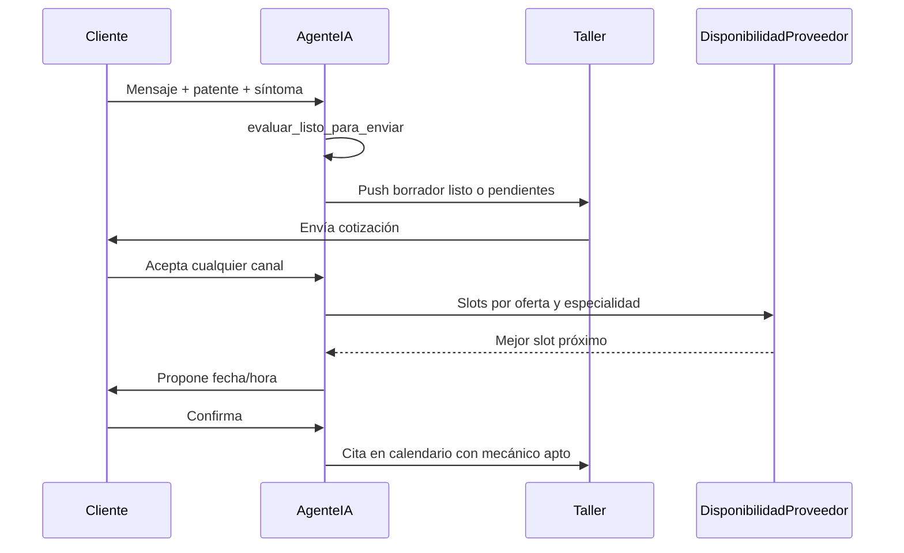

# Diseño — Agente IA: cotización lista + agenda óptima

**Change:** `agente-ia-cotizacion-agenda-optima`  
**Apps:** `agente_ia`, `ordenes`, `usuarios`  
**Fecha:** 2026-07-24

## Flujo objetivo

## Decisiones

| Decisión | Razón |
|----------|-------|
| Checklist en código Python, no solo LLM | Evita notificar al taller con borradores incompletos |
| `metadata.listo_para_enviar` | Sin migración; reutiliza JSONField existente |
| `crear_cita_desde_cotizacion_aceptada` compartido | Un solo camino cita + agendamiento |
| `requiere_especialidad=True` con fallback | Usa `disponibilidad_con_duracion` existente |
| Propuesta de 1 slot antes de lista abierta | Menos turnos de chat, mayor tasa de cierre |

## Archivos clave

- `agente_ia/services/cotizacion_borrador.py` — readiness
- `agente_ia/services/agendamiento_conversacional.py` — especialidad + propuesta
- `ordenes/services/cotizacion_publica.py` — cita unificada
- `ordenes/views_cotizacion_canal.py` — `marcar-aceptada`
- `ordenes/services/pipeline_comercial.py` — borradores en bandeja
