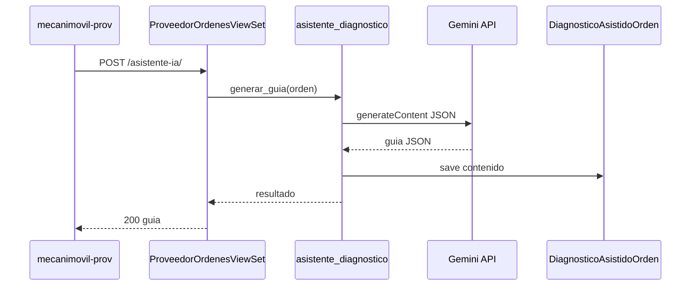

# Diseño — Asistente diagnóstico IA

**Change:** `asistente-diagnostico-ia`
**App Django:** `ordenes`
**Fecha:** 2026-07-02

## Flujo



## Esquema JSON de salida

```json
{
  "vehiculo": "Marca Modelo Año (cilindraje)",
  "problema_reportado": "texto",
  "causas_probables": ["..."],
  "procedimiento_reparacion_detallado": ["Paso 1: ..."],
  "referencia_manual": {
    "titulo": "...",
    "url": "https://..."
  },
  "advertencias_seguridad": ["..."]
}
```

## Decisiones

| Decisión | Razón |
|----------|-------|
| HTTP directo a Gemini | Consistente con `motor_semantico.py`, sin langchain |
| Cache en DB | Evita costos repetidos al reabrir la orden |
| Feature flag | Rollout gradual y control de costos |
