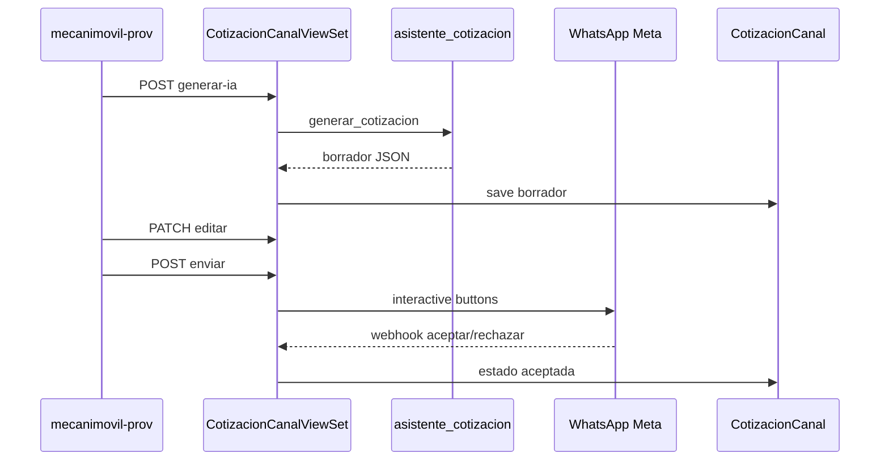

# Diseño — Cotización IA chat omnicanal

**Change:** `cotizacion-ia-chat-canal`
**App Django:** `ordenes`, `chat`, `omnichannel`
**Fecha:** 2026-07-03

## Flujo

## Esquema JSON IA

Ver `asistente_cotizacion/normalizar.py` — repuestos[], mano_obra_clp, duracion_minutos_estimada.

## Decisiones

| Decisión | Razón |
|----------|-------|
| HTTP directo Gemini | Consistente con asistente diagnóstico |
| repuestos en JSONField | v1 simplificado, editable vía PATCH |
| WhatsApp interactive v1 | Botones nativos sin página web |
| Messenger/IG texto + acción mandante | Meta quick replies en fase posterior |
