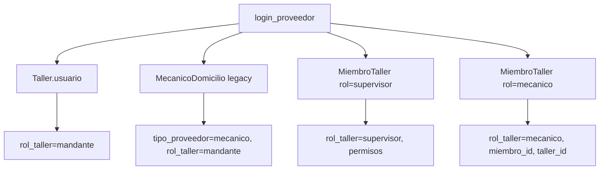

# Diseño — Sesión de mecánico del equipo

**Change:** `mecanico-sesion-api`
**App Django:** `usuarios`, `ordenes`, `checklists`
**Fecha:** 2026-07-02

## Resumen

Replica el patrón de supervisor para `MiembroTaller.rol='mecanico'`. El mecánico opera sobre el taller del mandante pero con alcance restringido a sus órdenes asignadas. No usa `permisos` JSON; las capacidades son fijas por rol.

## Resolución de sesión

## Capacidades fijas del mecánico

| Acción | Permitido |
|--------|-----------|
| Ver órdenes asignadas | Sí |
| Ver calendario propio | Sí |
| Iniciar/completar checklist (firma técnico) | Sí |
| Aceptar/rechazar órdenes | No |
| Gestionar equipo/servicios/finanzas | No |

## Compatibilidad

- Sin migración: reutiliza `MiembroTaller.usuario` (nullable).
- Mecánicos sin credenciales siguen siendo recursos agendables sin login.

## Decisiones

| Decisión | Alternativa | Razón |
|----------|-------------|-------|
| `permisos` vacío para mecánico | Permisos configurables | Requisito de producto: capacidades fijas |
| Scoping en queryset backend | Solo ocultar en UI | Seguridad |
| Notificar dueño + mecánico en checklist | Solo mecánico | Visibilidad del taller |
