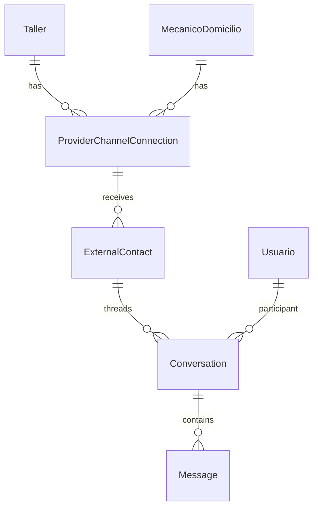

# Diseño — Mensajería omnicanal Meta

**Change:** `omnichannel-meta-messaging`
**App Django:** `mecanimovilapp.apps.omnichannel` (+ extensión `apps.chat`)

## Modelo ER



### ProviderChannelConnection

| Campo | Tipo | Notas |
|-------|------|-------|
| id | UUID PK | |
| content_type + object_id | GenericFK | Taller o MecanicoDomicilio |
| usuario | FK Usuario | owner |
| channel | WHATSAPP \| MESSENGER \| INSTAGRAM | |
| enabled | bool | default False |
| status | no_configurada \| pendiente \| conectada \| error \| desconectada | |
| access_token | CharField encrypted | Page/WABA token |
| phone_number_id | CharField | WhatsApp |
| waba_id | CharField | WhatsApp |
| page_id | CharField | Messenger |
| instagram_account_id | CharField | Instagram |
| display_name | CharField | |
| display_identifier | CharField | teléfono o @handle |
| oauth_state | CharField | |
| meta_business_id | CharField | |

Unique: `(content_type, object_id, channel)`

### ExternalContact

| Campo | Tipo |
|-------|------|
| channel | enum |
| external_id | CharField (wa_id, psid, ig_sid) |
| display_name | CharField |
| phone | CharField nullable |
| profile_picture_url | URL nullable |
| cliente | FK Cliente nullable |

Unique: `(channel, external_id, connection)` via FK to connection

### Conversation (extend)

- `source_channel`: APP \| WHATSAPP \| MESSENGER \| INSTAGRAM (default APP)
- `external_contact`: FK nullable
- `external_thread_id`: CharField nullable
- `type`: add OMNICHANNEL

### Message (extend)

- `direction`: inbound \| outbound (default outbound for app sends)
- `external_message_id`: CharField nullable
- `channel_metadata`: JSONField default {}

## Flujos

### Inbound webhook

1. `GET/POST /api/omnichannel/webhooks/meta/`
2. POST: validate `X-Hub-Signature-256`, enqueue `process_meta_webhook`
3. Worker resolves connection by `phone_number_id` or `page_id` or `instagram_account_id`
4. Upsert ExternalContact + Conversation + Message (inbound)
5. Broadcast `nuevo_mensaje_chat` + push

### Outbound (proveedor responde)

1. `POST /api/chat/conversations/{id}/send_message/`
2. If `source_channel != APP`: Celery `send_meta_message`
3. Graph API send, update Message with external_message_id

### OAuth Embedded Signup

1. `GET /api/omnichannel/connections/iniciar-conexion/?channel=whatsapp`
2. Return Meta OAuth URL with state stored on connection
3. `GET /api/omnichannel/oauth/callback/` exchanges code, stores tokens/IDs

## Env vars

```
OMNICHANNEL_ENABLED=True
META_APP_ID=
META_APP_SECRET=
META_VERIFY_TOKEN=
META_EMBEDDED_SIGNUP_CONFIG_ID=
META_OAUTH_REDIRECT_URI=https://<api>/api/omnichannel/oauth/callback/
META_GRAPH_API_VERSION=v21.0
```

## Runbook Meta (Fase 0)

App creada: **mecanimovil_connect** (App ID `1733581160975981`).

Guía detallada: [`docs/META_CONNECT_SETUP.md`](../../../docs/META_CONNECT_SETUP.md)

1. Crear Meta Business Portfolio para Mecanimovil
2. App **mecanimovil_connect** → agregar productos WhatsApp, Messenger, Instagram
3. Registrarse como Tech Provider → Embedded Signup configuration (opcional al inicio)
4. Webhook URL: `https://api.mecanimovil.com/api/omnichannel/webhooks/meta/`
5. Subscribe: `messages`, `messaging_postbacks` (Messenger/IG), WhatsApp message fields
6. App Review para producción; desarrollo con cuentas test
7. Env vars en Render Dashboard (API + Celery worker) — ver `META_CONNECT_SETUP.md`

## Seguridad

- Webhook signature HMAC SHA256 obligatorio en POST
- Tokens nunca en API responses (solo masked display)
- CSRF exempt solo en webhook view
- Rate limit webhook (django-ratelimit or simple cache counter)
