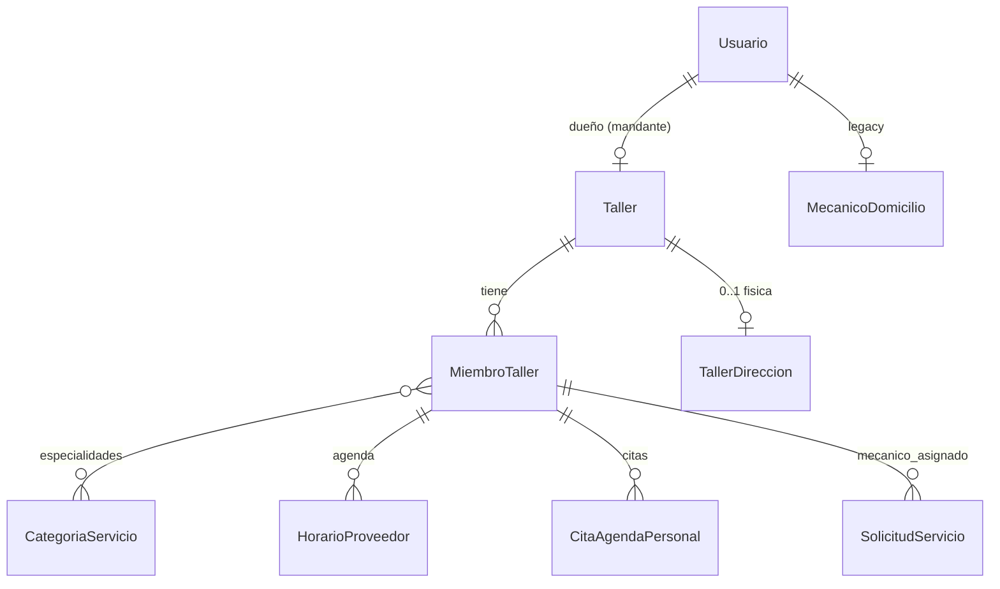

# Diseño — Proveedor unificado por modalidad + equipo de taller

**Change:** `proveedor-modelo-unificado-equipo`
**App Django:** `mecanimovilapp.apps.usuarios` (+ FKs en `apps.ordenes`)
**Fecha:** 2026-06-21

## Resumen

Se introduce el equipo de taller (`MiembroTaller`) como recurso agendable y se unifica la
atención por modalidad. Estrategia **strangler**: `Taller` pasa a ser el superset
"Proveedor"; `MecanicoDomicilio` se mantiene como legacy y se migrará después. El
discriminador `tipo_proveedor` se conserva para compatibilidad con el resto del stack
(~70 archivos backend, apps móviles desplegadas).

## Modelo de datos

### `MiembroTaller`

| Campo | Tipo | Null | Notas |
|-------|------|------|-------|
| `taller` | FK Taller CASCADE | NO | related_name `miembros` |
| `usuario` | OneToOne Usuario SET_NULL | SÍ | login opcional (futuro supervisor) |
| `rol` | CharField | NO | `mandante|supervisor|mecanico` |
| `nombre` | CharField(150) | NO | para mecánicos sin login |
| `especialidades` | M2M CategoriaServicio | — | requerido ≥1 si `mecanico` |
| `modalidad_tecnico` | CharField | NO | `en_taller|a_domicilio|ambas` default `en_taller` |
| `activo` | Boolean | NO | habilitado/deshabilitado (supervisor) default True |
| `fecha_creacion`/`fecha_actualizacion` | DateTime | NO | auditoría |

Constraints:
- `UniqueConstraint(taller, rol)` condicional a `rol in (mandante, supervisor)` → máximo uno de cada.
- Validación en `clean()`: `mecanico` requiere ≥1 especialidad (M2M se valida en serializer/servicio).

### Cambios aditivos

- `Taller.modalidad_atencion` (`en_taller` default), `Taller.radio_cobertura` (Decimal 5,2 default 10).
- `HorarioProveedor.miembro_taller` FK nullable + `UniqueConstraint(miembro_taller, dia_semana)`.
- `CitaAgendaPersonal.miembro_taller` FK nullable.
- `SolicitudServicio.mecanico_asignado` FK nullable.
- `MechanicServiceArea.taller` FK nullable (XOR con `mechanic`).

## Migración

1. AddField a `Taller`, `HorarioProveedor`, `CitaAgendaPersonal`, `SolicitudServicio`, `MechanicServiceArea`.
2. CreateModel `MiembroTaller` + M2M + constraints.
3. Data migration (`RunPython`) idempotente:
   - Por cada `Taller` con `usuario` y sin `MiembroTaller(rol=mandante)`: crear uno con `nombre`
     derivado del taller/usuario, `modalidad_tecnico` desde `taller.modalidad_atencion`.
   - Reverso: no-op seguro (no borra mandantes para no perder datos).

## Compatibilidad / fallback

- `tipo_proveedor` sin cambios; las queries existentes siguen funcionando.
- Disponibilidad y match consultan miembros solo si existen; si no, fallback a nivel taller.
- Deploy seguro: el esquema puede ir antes que la lógica de disponibilidad/match.

## Decisiones

| Decisión | Alternativa | Razón |
|----------|-------------|-------|
| Strangler (Taller superset) | Big-bang merge | Contiene blast radius del discriminador |
| `usuario` nullable en MiembroTaller | Usuario obligatorio | Mecánicos = recursos sin login |
| `especialidades` M2M | FK única | Producto: varias especialidades por mecánico |
| `modalidad` en Taller y miembro | Solo en Taller | Un mecánico del taller puede o no salir a domicilio |
